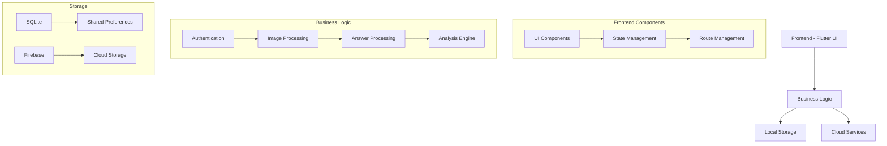
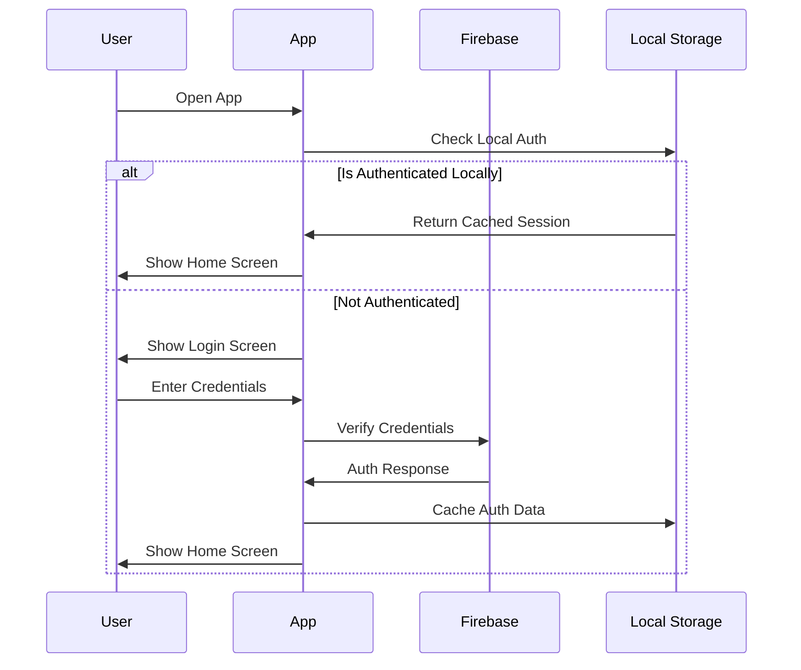
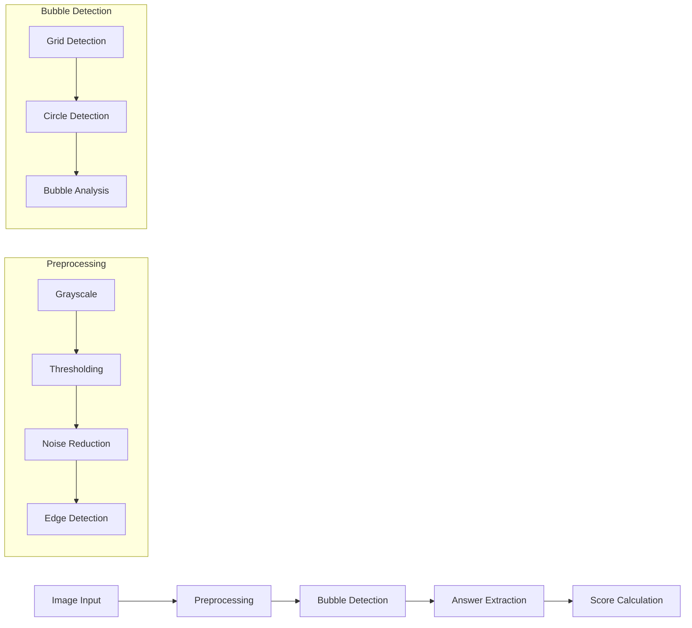
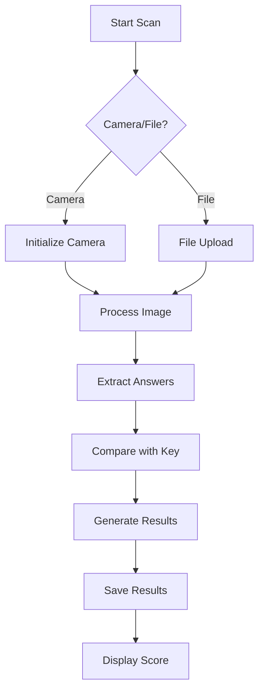
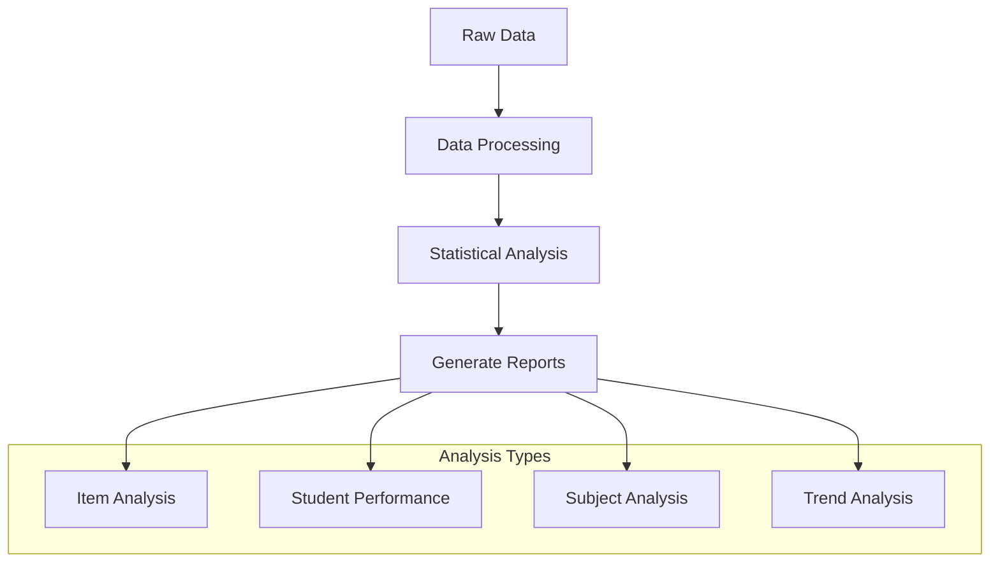

# ECMA (Exam Correction & Management Assistant)

## Overview
ECMA is a sophisticated Flutter-based application designed for automated exam correction and management. It utilizes advanced computer vision and machine learning algorithms to process bubble sheet answers, providing real-time scoring and comprehensive analysis.

## Features

### 1. Authentication System
- Secure login/signup using Firebase Authentication
- Offline authentication support
- User profile management
- Role-based access control

### 2. Bubble Sheet Processing
- Real-time scanning using device camera
- File upload support for batch processing
- Advanced image preprocessing
- Accurate bubble detection algorithm
- Support for multiple answer sheet formats

### 3. Answer Key Management
- Create/Edit answer keys
- Multiple subject support
- Version control for answer keys
- Import/Export functionality

### 4. Analysis Tools
- Item analysis
- Student performance tracking
- Subject-wise analysis
- Trend analysis
- Statistical reports

### 5. Offline Support
- Local data caching
- Synchronization when online
- Offline scanning capability
- Data persistence

## Technical Architecture

### System Components


### Authentication Flow


### Scanning Algorithm


## Machine Learning Components

### 1. Image Processing Pipeline
- **Preprocessing**:
  - Grayscale conversion
  - Adaptive thresholding
  - Gaussian blur for noise reduction
  - Perspective correction
  
- **Feature Detection**:
  - Hough Circle Transform for bubble detection
  - Contour detection for grid alignment
  - Corner detection for sheet orientation

### 2. Answer Detection Algorithm
```python
# Pseudocode for bubble detection
def process_bubble_sheet(image):
    preprocessed = preprocess_image(image)
    grid = detect_grid(preprocessed)
    bubbles = detect_bubbles(grid)
    
    for bubble in bubbles:
        filled_percentage = calculate_fill(bubble)
        if filled_percentage > THRESHOLD:
            mark_as_selected(bubble)
    
    return extract_answers(bubbles)
```

## Data Flow

### 1. Scanning Process


### 2. Analysis Process


## Performance Optimizations

### 1. Image Processing
- Chunked processing for large images
- Multi-threaded bubble detection
- Optimized memory usage
- Cache management

### 2. Data Management
- Efficient local storage
- Batch synchronization
- Compressed data storage
- Intelligent caching

## Security Features

### 1. Data Protection
- End-to-end encryption
- Secure local storage
- Protected PDF generation
- Access control

### 2. Authentication
- Biometric authentication option
- Token-based authentication
- Session management
- Secure credential storage

## Future Enhancements

### Planned Features
1. AI-powered answer validation
2. Advanced statistical analysis
3. Custom bubble sheet designer
4. Batch processing improvements
5. Enhanced offline capabilities

## Getting Started

### Prerequisites
- Flutter SDK
- Firebase account
- Android Studio/VS Code
- Camera-enabled device
